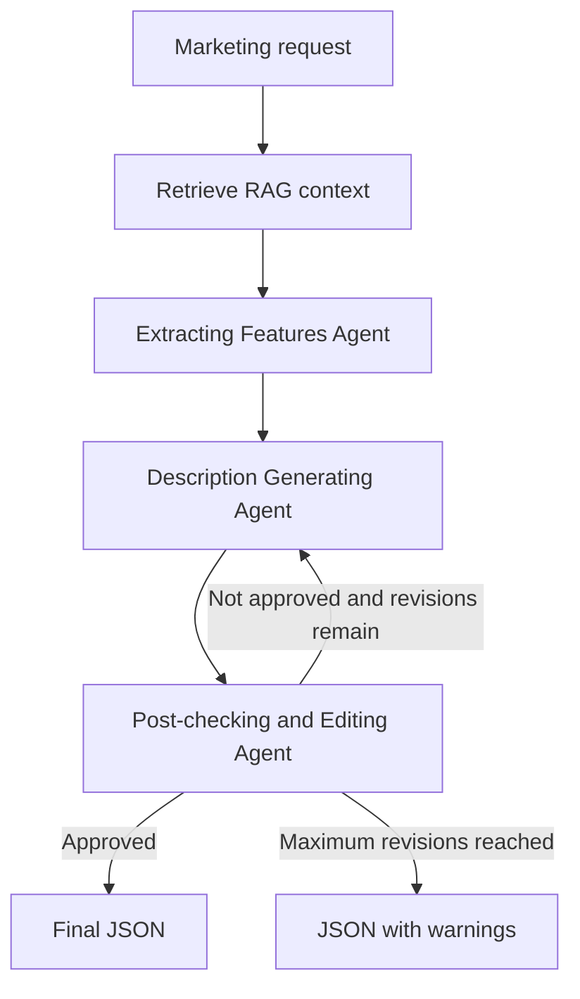

# AG-02 - Workflow ba Agent va JSON contract

## 1. Thông tin đầu việc

- Mã công việc: AG-02
- Người phụ trách: TV2
- Vai trò: Agent/Eval
- Mức ưu tiên: P0 - Nền móng
- Phụ thuộc: AG-01
- Framework đề xuất: LangGraph

## 2. Mục tiêu

Thiết kế workflow ba Agent và định nghĩa JSON contract bằng Pydantic để AI/RAG, Backend và Frontend có thể tích hợp thống nhất.

## 3. Ba Agent

### 3.1. Extracting Features Agent

Nhiệm vụ:

- Nhận thông tin doanh nghiệp và sản phẩm.
- Nhận context và sources từ RAG.
- Trích xuất đặc trưng có căn cứ.
- Gắn từng đặc trưng với nguồn RAG nếu có.

Output:

- Danh sách đặc trưng.
- Giá trị của từng đặc trưng.
- Mức tin cậy.
- Source được sử dụng.
- Cảnh báo thiếu dữ liệu.

### 3.2. Description Generating Agent

Nhiệm vụ:

- Nhận danh sách đặc trưng sản phẩm.
- Nhận mục tiêu, nền tảng và giọng văn.
- Sinh nội dung marketing có cấu trúc.

Output:

- Tiêu đề.
- Caption.
- CTA.
- Hashtag.
- Source được sử dụng.

### 3.3. Post-checking & Editing Agent

Nhiệm vụ:

- Kiểm tra tính trung thực.
- Kiểm tra mức độ phù hợp với yêu cầu.
- Kiểm tra nội dung có bám nguồn RAG không.
- Duyệt hoặc yêu cầu Agent sinh nội dung sửa lại.

Output:

- Quyết định duyệt.
- Các điểm đánh giá.
- Danh sách vấn đề.
- Hướng dẫn chỉnh sửa.

## 4. Workflow

## 5. Quy tắc chuyển node

| Node hiện tại | Điều kiện | Node tiếp theo |
| --- | --- | --- |
| Start | Request hợp lệ | Extracting Features |
| Extracting Features | Trích xuất thành công | Description Generating |
| Extracting Features | Không đủ dữ liệu | Dừng hoặc trả cảnh báo |
| Description Generating | Sinh thành công | Post-checking |
| Post-checking | Đạt | End |
| Post-checking | Không đạt, còn lượt sửa | Description Generating |
| Post-checking | Không đạt, hết lượt sửa | End với cảnh báo |
| Bất kỳ node | Lỗi không phục hồi | Failed |

## 6. Quy tắc mặc định bản nháp

- `max_revisions`: 2.
- Điểm đánh giá nằm trong khoảng 0 đến 1.
- Không được tạo đặc trưng không có trong input hoặc RAG.
- Khi RAG không đủ dữ liệu, output phải có warning.
- Tất cả output phải validate được bằng Pydantic.
- Không gửi dữ liệu lên cloud AI.

## 7. Quyết định thực thi cho AG-02

- `business_id` và `product_id` được xem là chuỗi định danh, không ép UUID.
- Input backend sử dụng `WorkflowRequest`.
- Output cuối sử dụng `WorkflowResult`.
- RAG không đủ dữ liệu sẽ tiếp tục theo luồng draft và có warning.
- Nền tảng hỗ trợ: `facebook`, `website`.
- `max_revisions` mặc định: `2`.
- Backend nhận output cuối và warnings tổng hợp, không cần nhận history từng step ở version này.

## 8. JSON mẫu

- [request.json](../ai-service/tests/fixtures/ag02/request.json)
- [workflow_result.json](../ai-service/tests/fixtures/ag02/workflow_result.json)
- [minimal_warning_result.json](../ai-service/tests/fixtures/ag02/minimal_warning_result.json)

## 9. Trạng thái review

- TV1 review RAG contract: done
- TV3 review API contract: pending
- TV4 review output hiển thị: pending
- Ngày chốt: 2026-07-19
